# Petiole


<a href="https://restruction.herokuapp.com/">Petiole Deployed on Heroku</a>

<a href="https://github.com/keeks-mtl/petiole">Petiole Github Repository</a>

## Goal For This Project

"Petiole" is a place for plant lovers to unite. Creating a safe haven to share their plant babies and see other beautiful and rare plants that others have collected. An opportunity to see how other people feel about different plants and get inspiration to expand your plant collection. 

## Table of Contents


## UX

### User Stories

- As a user, I want a clear & easy way to register and join.
- As a user, I want to see which plants are popular.
- As a user, I want to easily log in with my username and password.
- As a user, I want to find out more about Petiole on social media. 
- As a user, I want to discover & search plants.
- As a user, I want to look for a plant with a specific characteristic.
- As a user, I want to be able to add my plants to Petiole.
- As a user, I want to be able to "like" a specific plant.
- As a user, I want to be able to edit a plant post.
- As a user, I want to be able to delete plants i've posted.
- As a user, I want to easily and quickly log out. 
- As a user, I want to easily navigate the site in an intuitive way.
- As the site owner, I want users to be able to use my site easily. 

### Design Choices

- The site is based around my love of plants.
- The site itself needed to be easy to navigate, provide information users would find beneficial, and displays
    said information in a way that is visually appealing. 
- The overall design choice created a space that was malleable and gave space for a growing plant community. 
- The colour choices were centered around [colorspace](https://mycolor.space/) to find the complementary colour 
    palette that worked well and felt connected to plants (and the colour green) and evoked a sense of harmony. 
- Balsamiq was used to create the wireframes and organise how the site flowed. Balsamiq also helped visualise how the 
    the different pages would look on different screen sizes. 
- Once the project was built following the planning stages, there were ways that the design changed while building the site.
    Because my background isn't in design, it is hard to come up with something that appeals visually from a blank slate.
    The design process was an evolving process that required tweeks and changes to improve Pretiole and create something
    that looked appeasing. 

### Fonts

- The goal was to have a crisp and modern feel with a bit of punch. 
- The Brand and Titles for Pretiole used [Google Fonts](https://fonts.google.com/) Pacifico font. 
- Pacifico was chosen to create an eye-appealling look that stood out from the rest of the information
    on the page.
- The title font was paired with a crisp and readible font "Monserrat". 

### Icons

- Pretiole takes advantage of iconography by utilizing icons from [Font Awesome](www.fontawesome.com).
- Many of the buttons use icons to give a clear visual cue to solidify what the buttons do. 
- The icons made the content more concise and didn't distract from the information.
- An important icon used, is the hamburger icon that will make navigation more simple on mobile devices.
- Social media icons are also used to give clear indication of how to follow Pretiole on social media.
- The logo and favicon was chosen for it's simple representation of one of the most popular houseplant. 

### Colours

- The colour theme included five main colours that complimented one another.
- The colours were chosen because of their contrast and the way they can be associated with plants.
- Buttons were also color coded in a way that intrinsically implied what they accomplished. A soft red/pink
    to cancel or delete and a green to add/go forward.

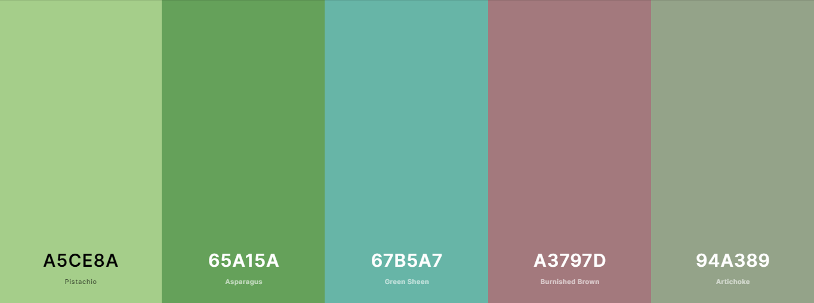

### Wireframes

- The wireframes that were used to initially design Petiole are below:

Plants page - desktop

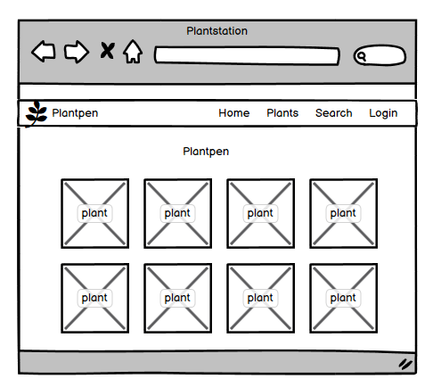

Plants page - mobile

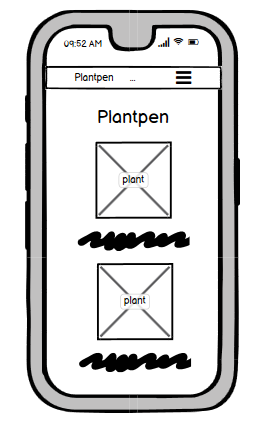

Plant page - desktop

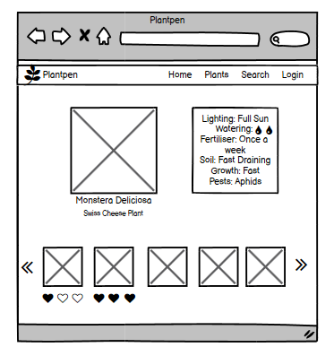

#### Changes to Wireframes
- The final site differs quite a bit from the original wireframes in many ways. 

## Features Implemented

### Navigation

- The navigation bar was created using Bootstrap to ensure that it was fully responsive.
- An example of a responsiveness change includes a hamburger menu when viewed on smaller viewports.
- The navigation bar shows Plants, Search, Login, and Register when a user is not logged in and when a user
    is logged in it shows Plants, Add Plant, Profile, Search, and Logout. 

Visitor Navigational Bar

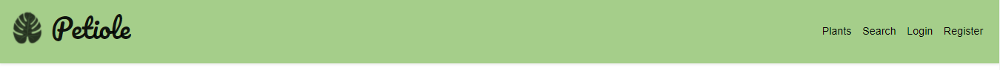

Logged In User Navigational Bar

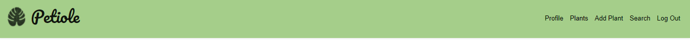

### Plant Cards

- There are multiple cards across the site to include information about the plants themselves.
- They are clear organised to be easily read and understood.
- On the main plants page the plant cards only have the plants names and image (and possibly 
    edit & delete button) on the other pages the plant cards have information on the plants.
- If a user is logged in and they created the plant card, they have the ability to edit or delete the card.
- The plant name is also a link to the plant page where you can see the information clearly and like the plant 
    as well. 

1. Plant Card Created By User Logged In
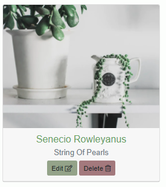

2. Plant Card On Plants Page
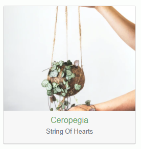

3. Plant Card On Search Page
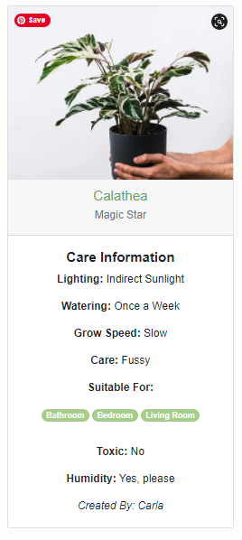

### Pagination

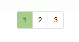

- The feature is used to make sure pages aren't filled with plant cards slowing down users viewing. 
- The main plant page and the search page displays 12 plant cards and displays the other cards on serveral pages. 

### Home/Plants Page

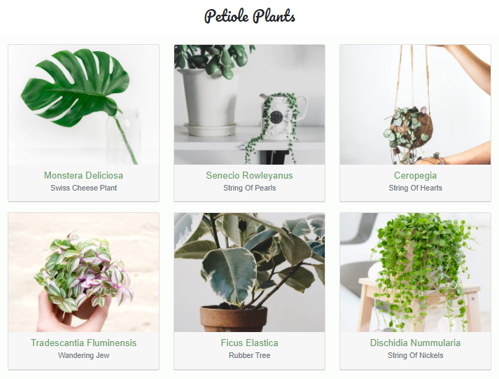
- Displays plants sorted by their popularity or "Likes"

### Register

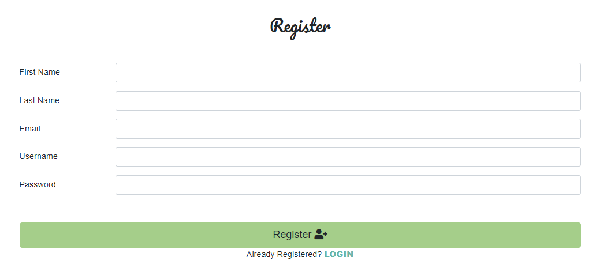

- The registration page allows users to register to use all of Pretiole's features.
- The registration form requires all of the following information to create an account:
    - User's first name 
    - User's last name
    - User's email
    - User's username
    - User's password
- All the data is then stored in a "users" collection on MongoDB database.
- The passwords are hashed.
- Once the register form is completed and the data is stored the user is redirected to their
    profile page and a flash message appears letting the users know their registration is succesful. 

### Log In

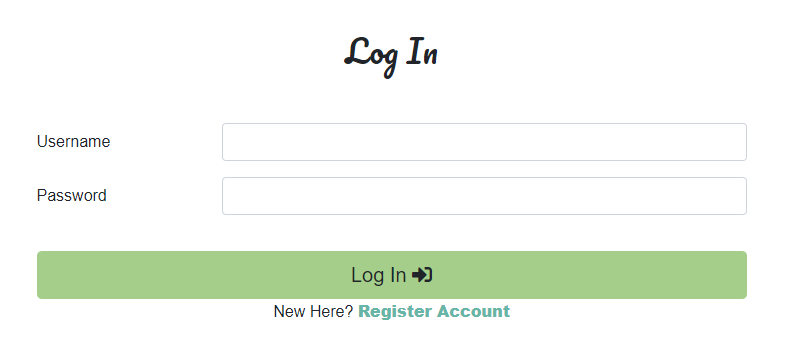

- Returning users who have already registered can use the log in form to 
    access Pretiole and their account. 
- The form requires a username and password which is then checked against their
    credentials stored in the database.
- If username or password is incorrect the user is flashed a message letting them know 
    username and/or password is incorrect. 
- Succesfully filling the form takes the user to their profile page. 

### Profile Page

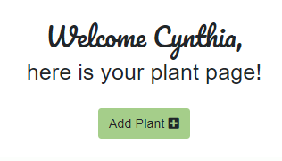

- The profile page allows users to see the plants that user has created. 
- On the page the user has the ability to sort their plants by either the plant's latin name
    or the plant's common name. 
- The Profile page shows the user's username and users also have the ability to click on the 
    "Add Plant" button to add to their collection. 

### Sort Plant Features

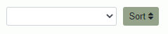

- On the profile page there is the ability to sort plants by these two options:
    - Plant Latin Name
    - Plant Common Name

### Add Plant Page

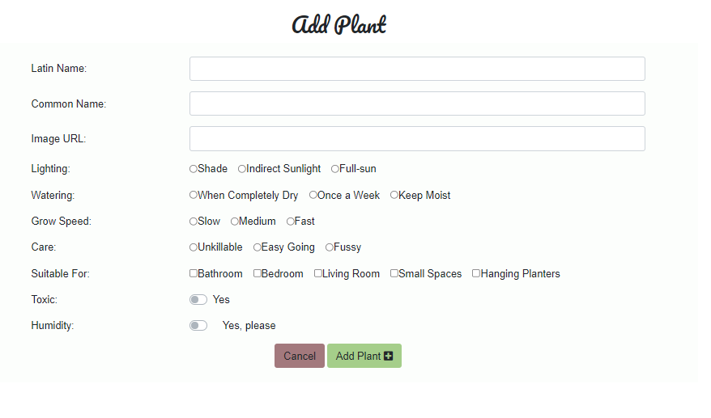

- The add plant page allows a user to submit a form to create a plant card with the following inputs:
    - Latin Name (text field)
    - Common Name (text field)
    - Image URL (text field)
    - Lighting (radio options)
    - Watering (radio options)
    - Grow Speed (radio options)
    - Care (radio options)
    - Suitable for (checkboxes)
    - Toxic (toggle option)
    - Humidity (toggle option)
- if the image url is broken or invalid a default image will be added the card.
- The form makes sure all fields are valid and before users can click "Add Plant" 
    button and the form sent. Once the button is clicked (and the form is valid) the 
    users are redirected to their profile page and a flash message appears telling them 
    they've added their plant.
- User's can access the page through the navigation bar or their profile page.
- The add plant route is protected so user's not logged in can not access the feature. 

### Edit Plant 

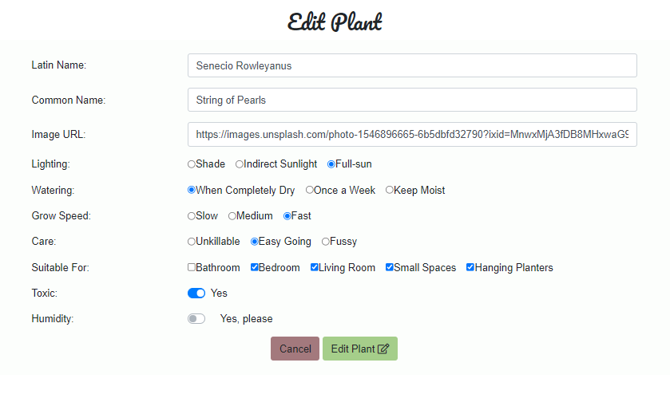

- The edit plant feature allows user's to edit the information on the plant card and update the card with 
    the new information.
- Only the logged in user who created the plant can use the edit plant form to update the information. 
- The form has all the information that was submitted when creating the form prepopulated allowing the user 
    to see what was submitted and change anything they'd like.
- Once the user has clicked the "Edit Plant" button they are redirected to their profile page and are shown 
    a flash message letting them know the plant was editted. 
- The edit plant feature can be accessed through the plant card to only the user who created it on the following 
    pages:
    - plants.HTML
    - profile.HTML
    - search.HTML
    - plant.html (through the plant's specific id)

### Delete Plant

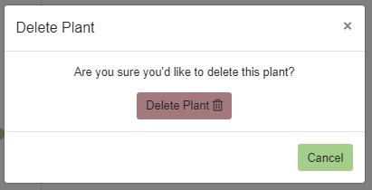

- A user can only use the delete plant function when they are logged in and they
    created the plant card. 
- When the "Delete" button is clicked a modal pops up asking for confirmation that the 
    user would like to delete the plant to prevent plants from accidentally being deleted.
- If the user clicks delete on the modal then the plant is deleted forever from Pretiole and the
    database.
- The delete plant modal can also be closed by either clicking the X icon or the cancel button.  
- The delete functionality can be accessed through the plant cards on the following pages:
    - Plants.html
    - Profile.html
    - Search.html
    - plant.html (through the plant's specific id)

### Plant Page

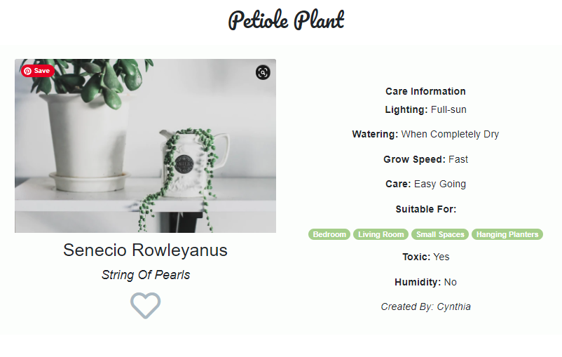

- Each specific plant has a page where users can see the information on the plant. 
- Everyone has access to this page through any page that has the specific plant's 
    plant card and is easily navigatable. 

### Like Plant

- A user has the ability to use the like feature only when logged in.
- A user can only like a plant once. 
- When clicked, the plant page reloads and adds a like to the count. 
- The "likes" are used to order the plants on the main plant page. 

### Search

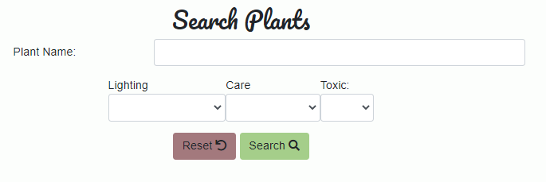

- Ability to search for specific plants by either their latin or common name. 
- Also have the ability to search for popular plant characterizations such as:
    - What lighting it requires
    - How much care it requires
    - Whether it is toxic/animal safe

### Log out

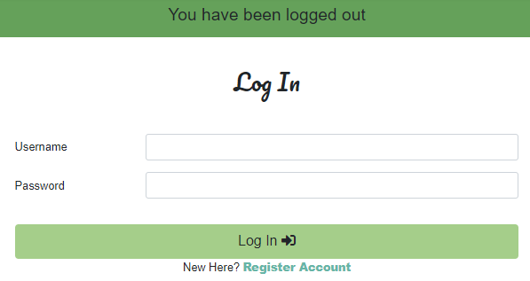

- The log out functionaly is located on the navigational bar and allows users 
    the ability to log out when clicked.
- The user when logged out is redirected to the log in page with a flash message
    that informs them they have been logged out. 

### Features Left to Implement

- Comment section for registered users to discuss the plants and share tips.
- Private messaging abilities for members to message other members to share information
    privately.
- Pagination on search page. 
- Abiltiy to undo a "like".
- Afiliate links to plant shops so users can buy plants they've seen.
- Share plant ability (share plant card through social media).
- To check in realtime on register form if the username already exists. 

## Database Design

2 Collections were used for the Petiole database on MongoDB.

### Collections Data structure

- The collections are associated with one another through the following ways.
    - liked_plant on users collection with _id of plant
    - created_by on plants collection with username of user

#### Users Collection

| Title | Key in db | form validation type | Data type |
--- | --- | --- | --- 
User ID | _id | None | ObjectId 
First Name | first_name | `maxlength="15"` | string
Last Name | last_name | text, `maxlength="25"` | string
Email Address | email | email, `maxlength="50"` | string
Username | username | `maxlength="15"` | string
Password | password | text, `maxlength="15"` | string
Plants They've Liked | liked_plant | None | array

#### Plants Collection
| Title | Key in db | form validation type | Data type |
--- | --- | --- | --- 
Plant ID | _id | None | ObjectId 
Latin Name | plant_latin_name |text, `maxlength="50"` | string
Common Name | plant_common_name | text, `maxlength="50"` | string
Plant url | plant_image | url | string
Lighting | lighting | radio | string
Watering | watering | radio | string
Growing Speed | grow_speed | radio | string
Care | care | radio | string
Suitable For | suitable_for | checkbox | array
Toxic | toxic | toggle | string
Humidity | humidity | toggle | string
Created By | created_by | None | string
Like count | plant_like | None | Decimal128

## Technologies Used

### Languages, Libraries and Frameworks

- [HTML5](https://developer.mozilla.org/en-US/docs/Web/HTML)
  - The base of the code for the overall structure of the site.
- [CSS3](https://developer.mozilla.org/en-US/docs/Web/CSS)
  - Used for the styling of the site.
- [Javascript](https://developer.mozilla.org/en-US/docs/Web/JavaScript)
  - JavaScript was used to add logic and functionality to my site.
- [JQuery](https://jquery.com/)
    - Used to activate the delete modal and delete funtionality. 
- [Python](https://www.python.org/)
    - used to write the logic that operates the site.
- [Font Awesome](https://fontawesome.com/)
  - For the icons used throughout the site.
- [Bootstrap](https://getbootstrap.com/)
  - Was used for added styling and responsiveness of the project.
- [Flask](https://flask.palletsprojects.com/en/1.1.x/)
    - To construct and render pages.
- [Jinja](https://jinja.palletsprojects.com/en/2.11.x/)
    -  Simplify how data is displayed from the backend of this project in html.
- [Werkzeug](https://werkzeug.palletsprojects.com/en/1.0.x/)
    - A collection of libraries used to create a WSGI compatible web application in Python.
- [Google Fonts](https://fonts.google.com/)
  - Used to import the main fonts for the styling of the project.
- [PyMongo](https://pypi.org/project/pymongo/)
    - To help MongoDB and Python communicate. 

### Tools

- [Github](https://github.com/)
  - Version control and recording of all changes to site during development process.
- [Gitpod](https://gitpod.io/)
  - The IDE used for developing this project.
- [Google Developer Tools](https://developers.google.com/web/tools/chrome-devtools)
  - Used to debug code and show styling changes before changing the actual code.
- [Balsamiq](https://balsamiq.com/)
  - Used for creating the wireframes in the planning stage.
- [W3C HTML Validator](https://validator.w3.org/)
  - Used as a HTML validator.
- [W3C CSS Validator](https://jigsaw.w3.org/css-validator/)
  - Used as a CSS validator.
- [JSHint](https://jshint.com/)
    - Used to test JS to ensure there were no errors.
- [PEP8 Online](http://pep8online.com/)
    - Used to check Python was PEP8 compliant.
- [WAVE](https://wave.webaim.org/)
    - Used to test accesibility of site.
- [MongoDB](https://www.mongodb.com/1)
    - Used for database functionality.
- [Heroku](https://www.heroku.com/home)
    - Used to host the site
- [Favicon](https://favicon.io/)
    - Used to generate the Favicon on the webpage tab.
- [AmIResponsive](http://ami.responsivedesign.is/#)
    - Used to create responsive images.

## Testing

Testing information can be found in this file : [testing.md](testing.md)

## Deployment

### Local Deployment
#### Requirements

- An IDE (such as Gitpod or Visual Studio Code)
- Python3
- PIP3
- MongoDB 

#### Instructions

- Open your IDE and in your terminal and clone the git repository with the following command.
    - git clone https://github.com/keeks-mtl/petiole
- Create environment file called "env.py" and add :
    ```
    import os

    os.environ.setdefault("IP", "0.0.0.0")
    os.environ.setdefault("PORT", "5000")
    os.environ.setdefault("SECRET_KEY", "<your secret key>")
    os.environ.setdefault("MONGO_URI", "<your mongo uri>")
    os.environ.setdefault("MONGO_DBNAME", "petiole")
    ```

- Add your env.py to your .gitignore. so it's not uploaded to github at any point.
- Upgrade pip locally with the command:
    ```
    pip install -U pip
    ```
- Install the modules used to run the application using in your terminal:
    ```
    pip freeze > requirements.txt
    ```
- In app.py, switch debug=False to debug=True
- Create a MongoDB account and create a database called "petiole"
- Create the following collections:

users
```
_id:<ObjectId>
first_name:<string>
last_name:<string>
email:<string>
username:<string>
password:<string>
liked_plant:<Array>
```

plants
```
_id:<ObjectId>
plant_latin_name:<string>
plant_common_name:<string>
plant_image:<string>
lighting:<string>
watering:<string>
grow_speed:<string>
care:<string>
suitable_for:<Array>
toxic:<string>
humidity:<string>
created_by:<string>
plant_like:<Decimal128>
```
- you can now run the application with the command
```
python3 app.py
```
- you can visit the website now at 
```
http://127.0.0.1:5000
```

### Heroku Deployment

- Open your IDE and in your terminal and clone the git repository with the following command.
```
git clone https://github.com/keeks-mtl/petiole
```
- create a requirements.txt file using the terminal command
```
pip3 freeze > requirements.txt
```
- Create a Procfile with the terminal command 
```
echo web: python app.py > Procfile
```
- 'git add' and 'git commit' the new requirements and Procfile and then 'git push'
    to GitHub
- Create an account on [Heroku](https://www.heroku.com/home)
- Create a new app on Heroku by clicking the "New" button in your dashboard and then 'Create New App'.
- Give the app an unique name and set the region.
- In the dashboard for your new app, click on "Deploy" > "Deployment method" and select GitHub
- A prompt will ask you to choose a GitHub repository to connect to. 
- Enter the repository name for the project and click search.
- Once you've found the repository, click the connect button.
- Confirm the linking of the Heroku app to the correct GitHub repository.
- In the heroku dashboard for the app, click on 'Settings' > 'Reveal Config Vars'
- Set the following config vars:
```
IP = 0.0.0.0
MONGO_DBNAME = petiole
MONGO_URI = 'mongodb+srv://<username>:<password>@<cluster_name>-qtxun.mongodb.net/<database_name>?retryWrites=true&w=majority'
PORT = 5000 
SECRET_KEY = '<your_secret_key>'
```
- in the Heroku dashboard, click "Deploy"
- Make sure master branch is selected and then click "Deploy Branch"

## Credits

### Content - Media -Inspiration

I have used the following websites to get info & images for my website.

#### Images
- [Pixabay](https://pixabay.com/)
  - Illustrative of monstera leaf for logo & illustration for 404 page
- [Unsplash](https://unsplash.com/)
  - Stock images for cards
- [Pexels](https://www.pexels.com/)
  - Stock images for cards

#### Information
- [Patch Plants](https://www.patchplants.com/gb/en/)
- [The Sill](https://www.thesill.com/)

#### Code
- [Scalegrid](https://scalegrid.io/blog/fast-paging-with-mongodb/)
    - How to add pagination to pages.
- [Code-Maven](https://code-maven.com/flask-return-404)
    - 404 error handler.
- [Pythonise](https://pythonise.com/series/learning-flask/flask-session-object)
    - Fix check to see if logged in to access page (add_plant).
- [Themeisle](https://themeisle.com/blog/missing-images-on-website/)
    - How to handle broken images.
- [StackOverflow](https://stackoverflow.com/questions/61829373/passing-data-to-a-bootstrap-modal-in-jinja-template-one-of-them-from-inside-a-f)
    - Confirm delete modal.
- [Flask](https://flask.palletsprojects.com/en/1.1.x/patterns/favicon/)
    - How to add favicon.
- [HTML.com](https://html.com/attributes/input-pattern/#:~:text=A%20regular%20expression%20is%20a,numerals%20(%200%2D9%20).)
    - Pattern attribute for inputs.
-[StackOverflow](https://stackoverflow.com/questions/47329938/block-form-submit-if-no-one-checkbox-checked)
    - Jquery validations for checkboxes

### Acknowledgements

- A special thank you to my mentor Antonija Simic for her help in going through my project thoroughly and guiding me through what 
    is expected of my website and how to clean up my code.
- The Code Institute Slack community for their technical support.

## Disclaimer
This website is for educational purposes only. 
