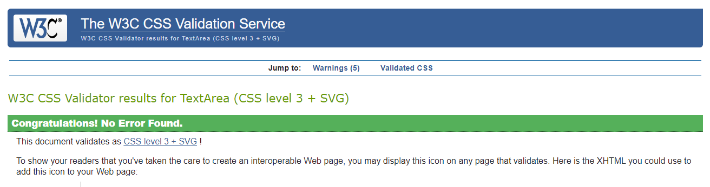
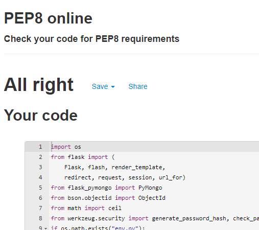

# Petiole - Testing

[Main README.md file](README.md)

[View website on Heroku](petiole-plants.herokuapp.com/)

## Table of Contents

## Code Validators
- [W3C CSS Validator](https://jigsaw.w3.org/css-validator/)
  - No errors, the results are below:
  

- [W3C HTML Validator](https://validator.w3.org/)
- [Pep8Online](http://pep8online.com/)
    - No errors, the results are below:
    
- [JSHint](https://jshint.com/)
    - No issues reported on script.js, results are below:
    ```
    Metrics
    There are 3 functions in this file.
    Function with the largest signature take 1 arguments, while the median is 1.
    Largest function has 3 statements in it, while the median is 3.
    The most complex function has a cyclomatic complexity value of 2 while the median is 1.
    ```
## Manual Testing

### Elements on Every page

1. Navbar
- Click on the **Logo** and confirm it takes you to the all plants page.
- Click on the **Brand Name** and confirm it takes you to the all plants page.
- Click on **Plants** and confirm it takes you to all plants page.
- Click on **Search** and confirm it takes you to the search page.
- Click on **Login** and confirm it takes you to the log in page.
- Click on **Register** and confirm it takes you to the register page.
- Log in to Petiole and confirm that the right links appear (Profile, Plants, Add Plant, Search, Logout).
- Click on **Profile** and confirm it takes you to the profile page.
- Click on **Add Plant** and confirm it takes you to the add plant page.
- Click on **Logout** and confirm it takes you to the log out page and you are no longer logged in.
- Check that hamburger icon appears on small devices and fits inline on all small device sizes.
- Make sure hamburger icon works and shows all proper links and that they work on all pages. 

2. Footer
- Click on the **Facebook Logo** and confirm that a link to Facebook pops up in another tab. 
- Click on the **Instagram Logo** and confirm that a link to Instagram pops up in another tab. 
- Click on the **Youtube Logo** and confirm that a link to Youtube pops up in another tab. 
- Click on the **Pinterest Logo** and confirm that a link to Pinterest pops up in another tab.
- Make sure footer icons are inline on all screen sizes.
- Check that the footer remains at the bottom of the pages that there is significantly less on. 


### All Plants page

#### General Testing
- Check if the plant cards are rendered?
- Check if there are twelve plant cards showing on the page?
- Make sure the plant cards show in proper rows and columns.
- Make sure the cards are ordered by most 'likes' and they change order if the 'likes' change.
 
#### Responsiveness Testing
- Check that there are twelve cards on iPad/medium sized screens.
    - Make sure they are rendered in 3 columns.
- Check that there are twelve3 cards on mobile/small sized screens.
    - Make sure they are rendered in single columns.
- Make sure there is a seamless change in card placements while manually changing screen size by width. 

### Search Page

#### General Testing
- Check that search form is rendered with all options.
- Make sure cards are ordered by latin name when page is initially opened.
- Try testing by multiple plant names
    - By a word in the plant name & by whole plant name.
    - Search by multiple keywords in plant names.
    - Make sure plant name is searching through both latin names and common names of plants.
    - Make sure when searching by name that isn't in database that the result section 
        shows "No Results Found"
- Try testing the **Lighting** dropdown option search
    - Choose every option in lighting and make sure only plants with those lighting requirements
        are displayed.
- Try testing the **Care** dropdown option search
    - Choose every option in care and make sure only plants with those care requirements
        are displayed.
- Try testing the **Toxic** dropdown option search
    - Choose every option in toxic and make sure only plants with those toxic requirements
        are displayed.
- Test the **Reset Button** and make sure the plant cards on the search page go back to their initial 
    setup. 

#### Responsiveness Testing
- Make sure search form is correctly sized and placed in all size screens.

### Login

#### General Testing
- Make sure login form is rendered.
- Click on **Register Account** and make sure it takes you to register page.
- Make sure the validations work
    - You can't submit an empty form. 
    - You can't submit form with just username filled in.
    - You can't submit form with just password filled in.
- Fill form with correct username and incorrect password.
    - Make sure flash message appears informing user that password and/or
        username is incorrect.
- Fill form with correct password but incorrect username.
    - Make sure flash message appears informing user that password and/or
        username is incorrect.
- Fill form with all incorrect information.
    - Make sure flash message appears informing user that password and/or
        username is incorrect.
- Log in with correct information and make sure it redirects user to their profile
    page. 
    
#### Responsiveness Testing
- Make sure log in form is rendered on all screen sizes with appropriate spacing. 
- Make sure everything is readable and clear on all screen sizes.

### Register

#### General Testing
- Make sure register form is correctly rendered.
- Click on **Login** link and check that it redirects to login page.
- Check that form validations work.
    - Every input has to be filled in order to submit the register form.
    - Inputs for first & last name has to be filled with just letters and hyphens.
    - Email has to follow correct email pattern.
    - Username & password can only have letters (lowercase & uppercase) and numbers.
- If user chooses a username that already exists when they submit the form they are flashed
    a message that informs them that the username already exists. 
- Once registered the user is redirected to the user's profile page with a flash message
    informing them they are registered. 

#### Responsiveness Testing
- On screen sizes small and bigger the form labels & inputs are inline.
- Everything is spaced out and easily readable on all screen sizes. 

### Profile

#### General Testing
- Title on profile page shows user's username and introduction.
- Add plant button takes you to add plant page
- Plant cards are rendered on profile page in order of plant added to database.
- Edit and delete buttons are visible on plant cards on profile page.

#### Responsiveness Testing
- Everything is clearly readable and spaced out properly on each screen size. 
- On mobile devices all plant cards are ordered in a single column. 

### Add Plant

#### General Testing
- Add plant page is only available to those logged in.
    - if user is not logged in they are redirected to plant page. 
- Make sure add plant form is rendered on page.
- All labels and input boxes are visible.
- Add plant form validations work.
    - Latin & common name input validations work.
    - Plant url input requires an url.
    - All radios require an option chosen
    - Suitable for checkboxes require at least one option picked.
- Cancel button redirects to profile page. 
- Add plant button only works when the required fields are filled and then 
    redirects to the profile page with a flash message that informs the user
    that they have successfully added the plant. 

#### Responsiveness Testing
- On every screen size the form remains readable and properly spaced.

### Edit Plant

#### General Testing
- The edit plant form is rendered on the page.
- See if the form is prefiled with the information already in the database. 
- Check to see if the form validations work. 
    - All required fields must be filled in.
    - The plant image url has to be an url.
- Check that the cancel button redirects the user to their profile page.
- Can only press the edit plant button when the form is filled with the required information.
- Check that the edit plant button redirects the user to the profile page with a flash message that
    informs them that the plant has been edited successfully.

#### Responsiveness Testing
- Checked that every screen size the form remains readable and spaced out correctly. 

### Delete Plant

#### General Testing
- The delete button is only visible to those that are logged and and if they created the plant card.
- The delete button on every page that it is visible (the plants page, the profile page, the search page and 
    the specific page for that plant) once clicked makes the delete plant modal pop up. 
- The modal is clearly titled to reflect what it does ("Delete Plant")
- Make sure there is is a clearly visible X (close button) to close the modal.
- Make sure the cancel button closes the modal as well.
- Check that there is a clearly readable confirmation message and a delete plant button.
- The delete plant button on the delete plant modal redirects the user to the user's profile page
    and there is a flash message that informs the user they have successfully deleted the plant. 
- Log out and try to access the delete_plant url for a specific plant and make sure the plant can 
    not be deleted.
- Log in and try to access the delete_plant url for a specific plant that wasn't created by that user.

#### Responsiveness Testing
- The delete button is clearly visible on all screen sizes. 
- Check that the delete plant modal is clearly readable on all screen sizes and is fully reponsive. 

### Logout

#### General Testing
- Click on the logout navigational link and check that it logs out the user.
- Make sure the user is redirected to the log in page once they have been logged out. 

#### Responsiveness Testing
- Make sure the log out button is accessible on all screen sizes.
- Make sure the log out buttton works on all screen sizes. 

### Plant Page for Specific Plant

#### General Testing
- Make sure all the following information about the plant is clearly visible:
    - Image of plant
    - Latin name
    - Common Name
    - Lighting
    - Watering
    - Grow Speed
    - Care
    - Suitable for 
    - Toxicity
    - Humidity requiremnts
- Make sure there is a like button on the plant. 
- Check that once logged in the edit / delete buttons are visible if the user created the plant card.

#### Responsiveness Testing
- Check that everything is clear and organized on all screen sizes. 
- Make sure the two columns change to one column on mobile devices. 

### Plant cards

#### General Testing
- Check that on pages with multiple cards that the plant cards are general uniform in size (okay with slight
    change of size on cards with more information)
- Ensure the images on the cards are clear and the same size no matter the size of the image chosen. 
- Check that the Latin Name on the cards are links that take the user to the specific plant's plant page. 
- The information on the cards is correctly listed.
    - Especially on the suitable_for array output on the card.
- Check the differences on the plant cards that are dependent on the page in which they are viewed. 
    - On all pages except the profile page the plant card shows who the card was created by. 
    - That when the user is logged in and created the plant card the card shows the edit and delete 
        buttons. 

#### Responsiveness Testing
- Check that the plant cards are easily read on all screen sizes dependent on their size (the plant cards size)
    - On big screens when they are in columns of four they are easily read.
    - On extra small screens when they are in single columns they are easily read. 

### Like Plant

#### General Testing
- Check that you can not like a plant unless logged in and that it redirects the user to the log in page.
- Visit the plant page of a plant that was liked by a user and check that the like button is red(or liked).
- Visit a plant page of a plant that was not liked by the user and check that the like button is grey(or not liked).
- Check that a user can't like a plant multiple times 
    - the plant id isn't added to their liked_plant array on the database
    - The plant_like number isn't incremented on the database. 
 
#### Responsiveness Testing
- Check the size of the heart on all screen sizes to make sure it doesn't overpower the text around it.

### Sort Feature

#### General Testing
- Select plant latin name from the dropdown list and click the sort button.
    - Check that the plants are in order of their latin names.
- Select plant common name from the drowpdown list and click the sort button.
    - check that the plants are in order of their common names. 
- click the sort button when nothing is chosen from the drowndown list.
    - check that the plants are in order of when they were added. 

#### Responsiveness Testing
-   Make sure sort box and options are readable and in proportion on all screen sizes.  

### Pagination Feature
#### General Testing
- Make sure on pages with more than 12 plant cards that the pagination is visible. 
- Check that the page that the user is on is the main shade of green.   

## Bugs

### Add_plant Bug

#### Bug
- When you click to add plant it just redirects to an empty add_plant page
#### Fix
- Change the code to check if user is logged in

### New User Like Bug
-   add_plant suddenly stopped working
#### Bug
- New users can't like plants
#### Fix
- Add liked_plant array to user when registering.

### Navbar Toggler Bug
-   Navbar toggle wasn't appearing
#### Bug
- The toggler was functional just wasn't visible
#### Fix
- Added a missing booststrap class to the navbar

### Toxic Search Bug
#### Bug
- When you try searching for plants that aren't toxic then you get no results.
#### Fix
- 

### Delete Plant Bug
#### Bug
- When you are logged in as a user you can access the delete_plant url of a specific plant that 
    you did not create and delete a plant. 
#### Fix
- 